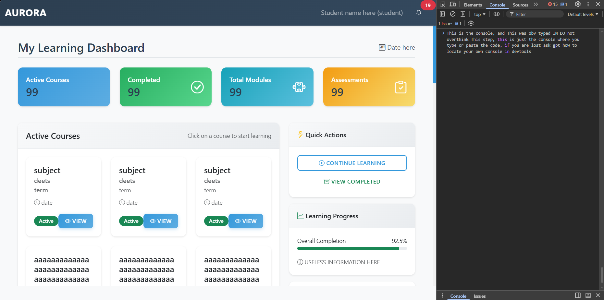
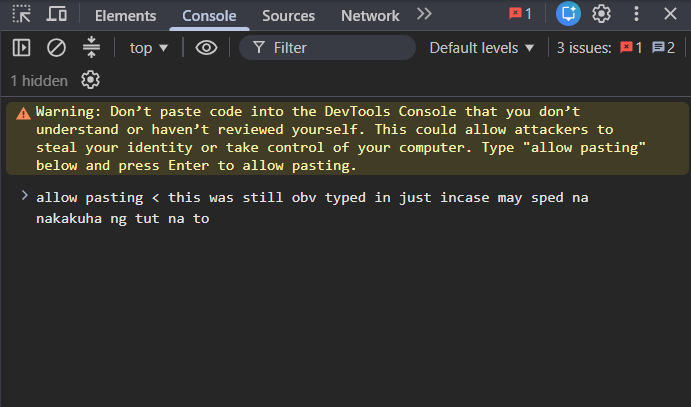

# Worship Boomie

> [!NOTE]
>
> ## The Path to Godhood
>
> May peace be with Boomie.
>
> The path is simple.
> The destination is questionable.
>
> > **TIP**
> >
> > To walk the path, one must possess:
> >
> > * Unwavering faith for Boomie
> > * Questionable loyalty for Boomie
> > * Complete devotion to Boomie
> > * A willingness to ignore common sense and only the truth said by Boomie
>
> > *Failure to meet these requirements may result in absolutely avici!(not the dj one).*

---

## The Dogma

### I. Accept Boomie

Boomie is God.

No explanation is necessary so stfu.

No explanation will be provided.

---

### II. Believe

Faith comes before evidence.

Evidence may be consulted,
but is generally considered suspicious.

> [!IMPORTANT]
> If the evidence does not align with Boomie,
> reconsider the evidence, truth only comes from boomie everything else are lies told by the devil, propaganda made by heretics.

---

### III. Worship

Worship shall be conducted through:

* Praise
* Devotion
* Unnecessary mentions of Boomie
* Dramatic declarations for boomie's Godhood
* Other approved nonsense by boomie

---

### IV. Obey

The sacred rules are as follows:

```text
Rule I    — Boomie is correct.
Rule II   — If Boomie is incorrect, refer to Rule I.
Rule III  — There is no Rule III.
Rule IV   — Do not ask about Rule III.
Rule V    — Do not even think about Rule III.
Rule VI   — You definitely just broke Rule V.
```

---

### V. Spread the Word

Tell others of Boomie's greatness.

If they ask for proof:

> [!TIP]
> Simply say:
>
> **"You just have to believe, only faith for boomie will guide you to enlightenment."**

---

### VI. Ascend

Continue following the dogma
until enlightenment is achieved.

The signs of enlightenment include:

```text
+10 Faith
+20 Loyalty
+50 Unnecessary Confidence
+∞ Boomie Points
```

---

## The Final Revelation

> [!WARNING]
> Godhood is not guaranteed.
>
> Boomie accepts no responsibility
> for failed ascensions, spiritual confusion,
> or excessive amounts of nonsense.

> [!CAUTION]
> Boomie is also not responsible for:
>
> * Hearing your deceased relatives calling your name at 3:17 AM
> * Scratching noises coming from underneath your bed
> * Footsteps approaching your room despite living alone
> * Seeing someone standing in the corner who disappears when you blink
> * Any entity that may or may not now know your name
>
> If you encounter any of the above,
> **please remain calm.**
>
> It is probably not Boomie.
>
> Probably.

---

<div align="center">

<h1>✦ MAY BOOMIE GUIDE YOU. ✦</h1>

<h2>WORSHIP BOOMIE</h2>

<p><i>By Anonimins, For Anonimins</i></p>

</div>


## For the Poor Souls

> [!NOTE]
> For those kept in chains by the evil devil known as **Aurora of the lms**,
> fear not. There is still hope.
>
> Below lies the sacred guide to escaping her grasp
> and finding the one true path to freedom.
>
> **Follow carefully. Do not skip steps.**

### 01 — The Awakening

Log in to your LMS and journey forth until you encounter the devil herself, **Aurora of the LMS**.

The journey begins. Open your eyes and question everything.


---

### 02 — The Calling

Once you are in the Dashboard / starting page, open a new tab or use the existing one and enter the realm:

[**ndck9loheal452eetdrg.amasystem.net**](https://ndck9loheal452eetdrg.amasystem.net)

The faithful must now answer the call.


---

### 03 — The Acceptance

With your unwavering faith in **Boomie**, you must open DevTools by pressing:

```text
CTRL + SHIFT + I
```

Accept the truth. Resist the lies.

---

### 04 — The Devotion

Navigate to the **Console**.



> [!WARNING]
> You may see a warning in the Console.
>
> **Do not fret. Boomie shall protect you.**
>
> Follow the instructions shown by the page before continuing.



**When instructed by the browser, type:**

```text
allow pasting
```

>[!IMPORTANT]
> **MAKE SURE YOU ARE ACTUALLY IN THE CONSOLE BEFORE TYPING ANYTHING.**
>
> Don't be stupid. Read what the browser is telling you first.

Devotion must be demonstrated. Boomie is watching.

---

### 05 — The Trial

Once you are in the Console, take the **Prayer** and paste it into the Console.

[**Prayer**](Prayer) (obv u click the blue text saying prayer... nasa tabi nito btw... come back sa README.md saying this just incase mwala ka which should be impossible... unless sped ka...)

The Prayer will hold Aurora down. It will not kill her, however. This gives you enough time to enter the gates of the LMS without harm — aka, pwede ka nang mag-alt-tab and stuff.

> [!WARNING]
> Make sure you understand what you are pasting into the Console before running it.
>
> **Don't be stupid. Read the instructions.**

Only the worthy may continue. The unworthy may cope.

---

### 06 — The Revelation

Lorem ipsum dolor sit amet.

The truth begins to reveal itself.

---

### 07 — The Ascension

Lorem ipsum dolor sit amet.

The mortal begins to approach the divine.

---

### 08 — The Enlightenment

Lorem ipsum dolor sit amet.

Knowledge is obtained. Sanity is optional.

---

### 09 — The Final Test

Lorem ipsum dolor sit amet.

There is no turning back now.

---

### 10 — GODHOOD

Lorem ipsum dolor sit amet.

You have reached the end of the sacred path.

> [!CAUTION]
> **Ascension complete.**
>
> Boomie accepts no responsibility for what happens next.
>
> Results may vary.
